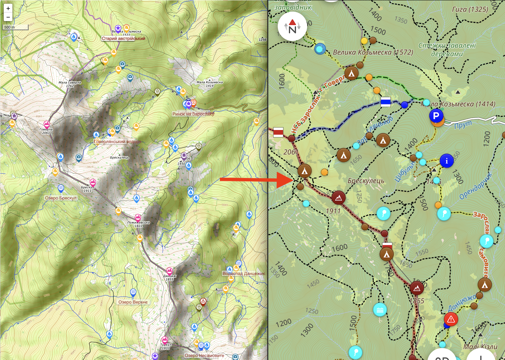

# vpohid-gpx-converter



Конвертер точок з JSON у GPX 1.1 з опціональними розширеннями OsmAnd (іконки та кольори).

Цей інструмент допомагає перетворити список локацій (з координатами та додатковими полями) у стандартний GPX або у GPX із візуальними розширеннями, сумісними з OsmAnd.

## Можливості
- Стандартний GPX 1.1 або GPX із розширеннями OsmAnd (іконки, кольори, бекграунд).
- Джерела даних: локальний JSON-файл або прямий URL із JSON-відповіддю (response.items / items).
- Групування точок:
  - в одну спільну групу (type = назва групи);
  - або за полем `kind` кожної точки.
- Додавання посилання на сторінку точки до опису.
- Керування через змінні середовища та зручний CLI.

## Встановлення
1. Встановіть залежності (Python 3.8+):
   
   ```bash
   pip install -r requirements.txt
   ```

2. (Необов'язково) створіть файл `.env` у корені репозиторію на основі прикладу:
   
   ```bash
   cp .env.example .env
   ```

## Формат вхідного JSON
Очікується масив об'єктів. Мінімально необхідні поля: `latitude`, `longitude`.
Додаткові (опціональні) поля: `sealevel`, `whenadded`, `title`, `description`, `viewurl`, `kind`.

Якщо джерелом є URL, який повертає об'єкт із полем `response.items` (як на vpohid.com.ua), скрипт автоматично витягне масив із цього поля. Також підтримується варіант з кореневим `items`.

Приклад елемента:

```json
{
  "latitude": 48.12345,
  "longitude": 24.12345,
  "title": "Говерла",
  "description": "Красива локація",
  "viewurl": "/place/123",
  "kind": "mount",
  "whenadded": "2024-08-18 10:00:00",
  "sealevel": 1234
}
```

## Запуск
Найпростіший варіант (стандартні значення):

```bash
python convert.py
```

CLI параметри:

- `-i, --input` — шлях до вхідного JSON-файлу (за замовчуванням: `my_places.json`).
- `-u, --url` — URL, що повертає JSON з полем `response.items` (або просто `items`).
- `-o, --output` — шлях до вихідного GPX-файлу (за замовчуванням генерується автоматично залежно від режиму OsmAnd).
- `--osmand-extensions` / `--no-osmand-extensions` — увімкнути/вимкнути розширення OsmAnd.
- `--single-group` / `--by-kind` — усі точки в одну групу або групування за `kind`.
- `--group-name` — назва групи (якщо використовується одна група).
- `--base-url` — базова адреса для формування повних посилань (використовується разом із `viewurl`).

Приклади:

```bash
# 1) Конвертувати стандартно (з .env або дефолтів)
python convert.py

# 2) Вказати вхід і вихід явно (файл)
python convert.py -i my_places.json -o result.gpx

# 3) Завантажити напряму з URL (приклад з vpohid.com.ua)
python convert.py -u "https://vpohid.com.ua/json/map/v/items/?kind%5B%5D=routes&kind%5B%5D=placeofinterest&kind%5B%5D=parking&kind%5B%5D=mount&kind%5B%5D=lake&kind%5B%5D=photo&zoom=12&bounds%5BboundNorthEastLat%5D=48.194471302637616&bounds%5BboundSouthWestLat%5D=47.88964287376369&bounds%5BboundNorthEastLng%5D=24.79611513873716&bounds%5BboundSouthWestLng%5D=24.371081569401227"

# 4) Вимкнути розширення OsmAnd і групувати за kind
python convert.py --no-osmand-extensions --by-kind

# 5) Увімкнути одну групу з назвою
python convert.py --single-group --group-name "Мої точки"

# 6) Вказати власну base URL для посилань
python convert.py --base-url "https://vpohid.com.ua"
```

## Змінні середовища
Ви можете керувати конфігурацією через ENV або файл `.env`. Значення з CLI мають пріоритет над ENV.

- `USE_OSMAND_EXTENSIONS` — `true|false` (за замовчуванням: `true`).
- `USE_SINGLE_GROUP_NAME` — `true|false` (за замовчуванням: `true`).
- `GROUP_NAME` — назва групи (за замовчуванням: `Імпорт з vpohid.com.ua`).
- `INPUT_JSON_FILE` — шлях до вхідного JSON (за замовчуванням: `my_places.json`).
- `INPUT_URL` — URL, що повертає JSON (у форматі з `response.items` або `items`).
- `OUTPUT_GPX_FILE` — шлях до вихідного GPX (за замовчуванням: генерується автоматично).
- `BASE_URL` — базова адреса для побудови повних посилань (за замовчуванням: `https://vpohid.com.ua`).

Для логічних значень підтримуються: `1, true, yes, on` (регістр і пробіли ігноруються).

## Ліцензія
Цей проєкт розповсюджується за ліцензією MIT. Див. файл LICENSE.

## Розробка
- Дивіться `convert.py` — основна логіка конвертації.
- Pull requests та issues вітаються.

## Посилання
- Репозиторій: https://github.com/gekich/vpohid-gpx-converter
- Issues: https://github.com/gekich/vpohid-gpx-converter/issues
- Pull Requests: https://github.com/gekich/vpohid-gpx-converter/pulls
